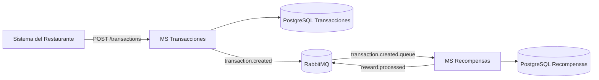
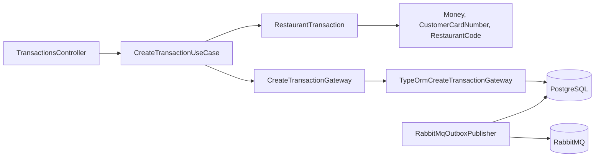
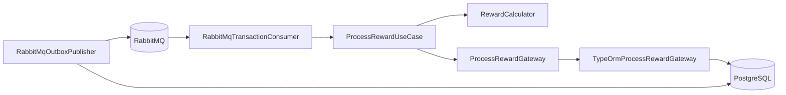
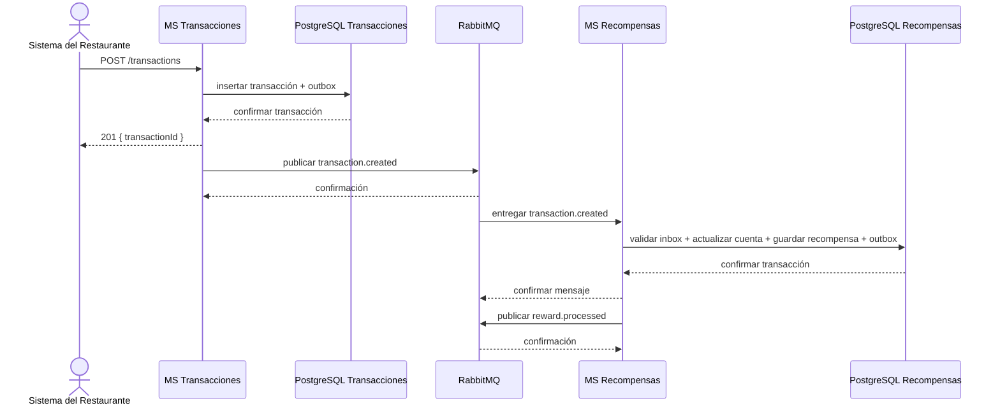
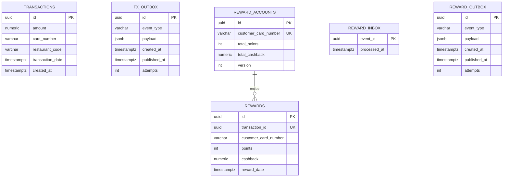
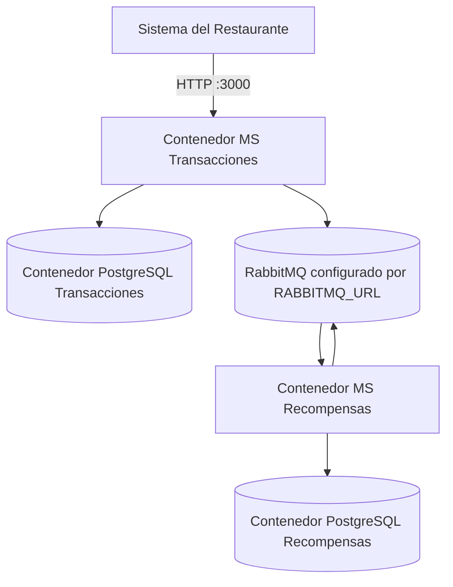

# Sistema de Recompensas Orientado a Eventos

Sistema de recompensas para consumos en restaurantes. Está implementado como un monorepo con dos microservicios independientes construidos con NestJS, TypeScript, TypeORM, PostgreSQL y RabbitMQ.

## Arquitectura General

El Servicio de Transacciones registra un consumo y publica el evento `transaction.created`. El Servicio de Recompensas consume ese evento, calcula los beneficios, actualiza la cuenta del cliente y publica `reward.processed`.



Cada microservicio es dueño de su base de datos. No existen consultas directas entre bases de datos ni llamadas HTTP entre microservicios.

### MS Transacciones

Recibe solicitudes HTTP, valida los datos, persiste la transacción y registra
el evento saliente en un outbox.



| Clase | Responsabilidad |
| --- | --- |
| `RestaurantTransaction` | Agregado raíz de una transacción válida |
| `Money` | Valida montos positivos con máximo dos decimales |
| `CustomerCardNumber` | Valida identificadores de cliente de 9 a 32 dígitos |
| `RestaurantCode` | Valida códigos de restaurante |
| `CreateTransactionUseCase` | Orquesta la creación de la transacción |
| `CreateTransactionGateway` | Puerto de salida de la aplicación |
| `TypeOrmCreateTransactionGateway` | Guarda transacción y outbox atómicamente |
| `TransactionsController` | Adaptador REST |
| `RabbitMqOutboxPublisher` | Publica eventos pendientes confirmados por RabbitMQ |

### MS Recompensas

Consume eventos, calcula beneficios, actualiza saldos y registra el evento de
recompensa procesada.



| Clase | Responsabilidad |
| --- | --- |
| `RewardCalculator` | Calcula puntos y cashback |
| `RewardAccount` | Aplica recompensas al saldo acumulado |
| `ProcessRewardUseCase` | Orquesta el procesamiento de recompensas |
| `ProcessRewardGateway` | Puerto de salida de la aplicación |
| `TypeOrmProcessRewardGateway` | Guarda cuenta, recompensa, inbox y outbox atómicamente |
| `RabbitMqTransactionConsumer` | Consume y valida `transaction.created` |
| `RabbitMqOutboxPublisher` | Publica eventos `reward.processed` pendientes |

## Casos de Uso

### Registrar Transacción

1. El cliente envía `POST /transactions`.
2. El controlador valida el DTO.
3. El caso de uso crea el agregado `RestaurantTransaction`.
4. Se guardan la transacción y el evento outbox en una única transacción SQL.
5. Se devuelve el UUID de la transacción.
6. El publicador outbox envía `transaction.created` a RabbitMQ.

### Procesar Recompensa

1. RabbitMQ entrega `transaction.created`.
2. El consumidor valida el evento y verifica que no haya sido procesado.
3. `RewardCalculator` calcula puntos y cashback.
4. Se guardan la cuenta, recompensa, inbox y outbox en una única transacción SQL.
5. El consumidor confirma el mensaje.
6. El publicador outbox envía `reward.processed`.

## Reglas de Recompensa

```text
puntos   = floor(monto / 10)
cashback = round(monto * 0.02, 2)
```

| Consumo | Puntos | Cashback |
| ---: | ---: | ---: |
| `9.99` | `0` | `0.20` |
| `100.00` | `10` | `2.00` |
| `125.75` | `12` | `2.52` |

Los cálculos usan `decimal.js` y la persistencia usa `numeric(12, 2)`.

## API REST

### `POST /transactions`

Registra un consumo:

```json
{
  "amount": 100,
  "cardNumber": "123456789",
  "restaurantCode": "REST001"
}
```

Respuesta `201 Created`:

```json
{
  "transactionId": "uuid-generado"
}
```

Se rechazan montos no positivos, montos con más de dos decimales, tarjetas con
menos de 9 o más de 32 dígitos y códigos de restaurante inválidos.

## Confiabilidad

RabbitMQ entrega mensajes al menos una vez. El sistema usa Outbox
Transaccional e Inbox Idempotente para evitar pérdida de eventos y recompensas
duplicadas.



Medidas implementadas:

- Escrituras de negocio y outbox atómicas.
- Inbox por `eventId` para ignorar entregas duplicadas.
- `transaction_id` único en recompensas.
- Confirmaciones del publicador RabbitMQ.
- Dead-letter queue para mensajes inválidos.
- Bloqueo pesimista y columna de versión para actualizar cuentas.

## Modelo de Datos



### Base de Datos de Transacciones

Propiedad de MS Transacciones. Inicializada por
`ms-restaurant/database/init.sql`.

| Tabla | Propósito |
| --- | --- |
| `transactions` | Historial de consumos |
| `outbox_messages` | Eventos `transaction.created` pendientes o publicados |

### Base de Datos de Recompensas

Propiedad de MS Recompensas. Inicializada por `ms-rewards/database/init.sql`.

| Tabla | Propósito |
| --- | --- |
| `reward_accounts` | Saldo acumulado por cliente |
| `rewards` | Historial de recompensas |
| `inbox_messages` | Eventos procesados para evitar duplicados |
| `outbox_messages` | Eventos `reward.processed` pendientes o publicados |

## Despliegue



La configuración se centraliza en un único archivo `.env` raíz ignorado por
Git. Cree su archivo local desde la plantilla versionada:

```bash
cp .env.example .env
```

Variables disponibles:

| Variable | Propósito | Requerida |
| --- | --- | --- |
| `RABBITMQ_URL` | Conexión AMQP o AMQPS al broker | Sí |
| `RABBITMQ_EXCHANGE` | Exchange RabbitMQ | No, default: `rewards.exchange` |
| `TRANSACTION_QUEUE` | Cola consumida por MS Recompensas | No, default: `transaction.created.queue` |
| `RESTAURANT_PORT` | Puerto HTTP de MS Transacciones | No, default: `3000` |
| `TRANSACTIONS_DB_*` | Nombre, usuario, contraseña, host interno y puerto local de PostgreSQL | No, poseen defaults locales |
| `TRANSACTIONS_DATABASE_URL` | PostgreSQL de transacciones | Sí al ejecutar sin Docker |
| `REWARDS_PORT` | Puerto de MS Recompensas | No, default: `3001` |
| `REWARDS_DB_*` | Nombre, usuario, contraseña, host interno y puerto local de PostgreSQL | No, poseen defaults locales |
| `REWARDS_DATABASE_URL` | PostgreSQL de recompensas | Sí al ejecutar sin Docker |
| `DB_SYNCHRONIZE` | Sincronización automática TypeORM | No, default: `false` |

Las credenciales RabbitMQ no se almacenan en Git. Configure como mínimo:

```dotenv
RABBITMQ_URL=amqp://<usuario>:<contrasena>@<host>:<puerto>/<virtual_host_codificado>
```

Para el virtual host `/`, use `%2F`:

```dotenv
RABBITMQ_URL=amqp://<usuario>:<contrasena>@<host>:5672/%2F
```

Ejecute:

```bash
docker compose up --build
```

Pruebe el flujo:

```bash
curl -X POST http://localhost:3000/transactions \
  -H 'Content-Type: application/json' \
  -d '{"amount":100,"cardNumber":"123456789","restaurantCode":"REST001"}'
```

## Pruebas y Calidad

Pruebas unitarias, cobertura y compilación:

```bash
cd ms-restaurant
pnpm install
pnpm exec eslint "{src,test}/**/*.ts"
pnpm run test:cov --runInBand
pnpm run build

cd ../ms-rewards
pnpm install
pnpm exec eslint "{src,test}/**/*.ts"
pnpm run test:cov --runInBand
pnpm run build
```

Pruebas de integración con PostgreSQL y RabbitMQ disponibles:

```bash
RUN_STACK_INTEGRATION=true pnpm run test
```

Pruebas E2E con el stack Docker activo:

```bash
RUN_STACK_E2E=true pnpm run test:e2e
```

El pipeline de GitHub Actions ejecuta formato, lint, cobertura, integración y compilación. Para las pruebas usa PostgreSQL y RabbitMQ efímeros, sin depender de credenciales externas.
